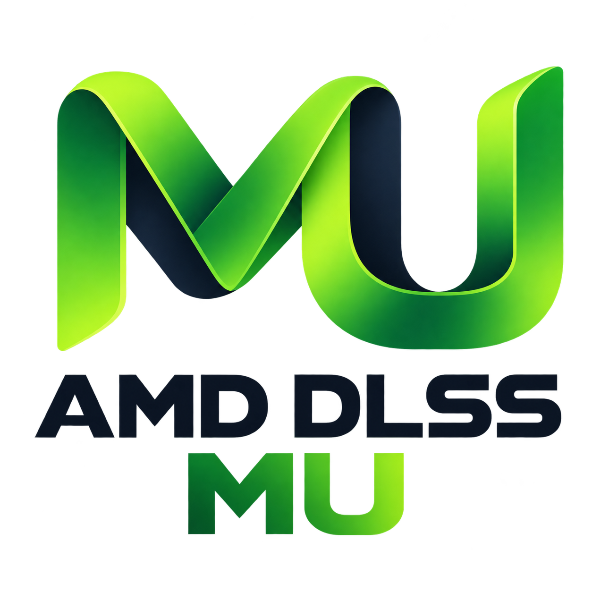
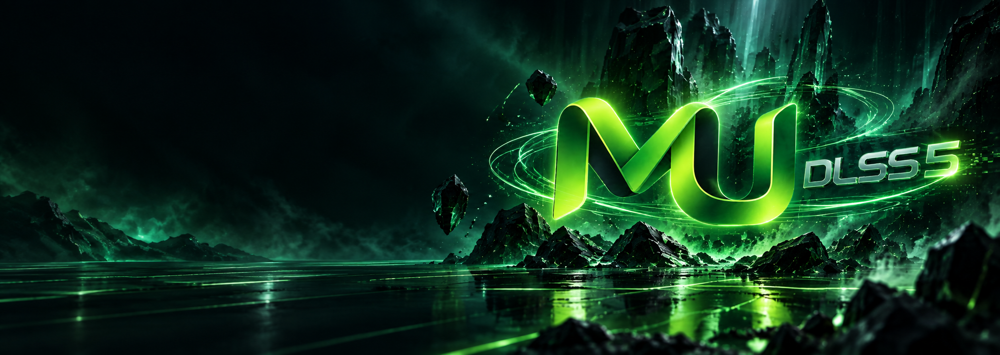

<p align="center">
  
</p>

# AMD DLSS MU

面向 Windows 的游戏管理与图形方案配置工具。管理本地游戏，下载并校验所需组件，配置 DLSS-NR on AMD / OptiScaler，或通过「大力喜鹊」启动独立窗口缩放工具。

[项目官网](https://amd-dlss-mu.claude-api.cn/) · [版本下载](https://github.com/xiarongwu123/AMD-DLSS-MU/releases) · [问题反馈](https://github.com/xiarongwu123/AMD-DLSS-MU/issues) · [联系作者](#联系作者)

<p align="center">
  
</p>

## 当前版本

当前正式版本为 `2.1.1`，包含智能推荐、一键排查、许愿池、下载续传，以及 RX 6000 的 HIP 7.2 安装引导。客户端内部版本须与官网发布清单中的版本一致，以便自动更新校验。

## 主要功能

### 智能推荐与一键排查

在游戏库点击“智能推荐”，可以选“画质优先”“帧率优先”或“自定义”。画质优先保留原有 DLSS 5 模式一。帧率优先在 RX 6000 / 7000 / 9000、至少 8 GB 显存及安装条件满足时，使用 TheAutomatic v1.10.3.1 与 DLSS5-6x-AMD-OptiScaler v10.6 的已校验发布包，安装 DLSS 5 神经渲染（daniel v0.6.0 Fast）与 OptiScaler XeFG 2X。MU 直接配置并记录文件，不运行整合包中的开关程序。游戏需要可用的 DLSS / XeSS 超分入口；此路线使用 OptiFG 输入，无须在游戏里开启 FSR 超分或原生 FSR 帧生成。进游戏按 Insert 检查神经渲染与 XeFG 实际状态；软件不会自动修改游戏设置，也不保证帧率提升。自动条件不满足时推荐标准 OptiScaler；RX 6000 需 AMD HIP 7.2；推荐不代表已实测通过。30X 等更高倍率仍属实验功能，MU 当前自动路线不启用。自定义标准 OptiScaler 可为有原生 DLSSG 或 FSR FG 的 DX12 游戏尝试 FSR FG 2X：先在游戏内开启原生帧生成，再在 OptiScaler 中启用 FG、保存配置并重启游戏，最后验证效果。

配置后，游戏封面的“一键排查”会检查显卡、驱动信息、HIP、方案文件、加载文件和游戏接口线索，以简短文字说明缺项。文件齐全只表示安装条件通过，实际加载和效果仍需进入游戏验证。

- **本地游戏库**：扫描、搜索和手动添加游戏，按配置状态筛选，五列展示游戏封面。
- **配置与恢复**：从游戏卡片开启配置，查看进度，通过高级选项选择方案，按安装记录恢复游戏文件。
- **下载管理**：展示组件下载进度，支持暂停、继续、取消和重试，下载完成后核对大小与 SHA-256。
- **大力喜鹊**：下载、校验并启动独立 Magpie 便携版本，保存独立配置。
- **MU 账户**：邮箱注册、登录、密码管理和账户中心，业务功能根据服务端权限开放。
- **桌面体验**：深浅色主题、中文/英文切换、游戏卡片 Hover、应用图标和可复制的安装错误详情。

## 三种方案怎么选

| 方案 | 用途 | 使用要点 |
| --- | --- | --- |
| DLSS-NR on AMD | 使用上游 AMD 神经渲染运行时 | 要求支持的 AMD 显卡、AMD HIP 运行时和 DX12 + FSR 游戏；游戏内开启 FSR，按 `End` 查看菜单 |
| OptiScaler 标准版 | 超分与帧生成适配 | 根据游戏接口选择 DX11/DX12 或 Vulkan；使用 `Insert` 菜单；具体效果依赖游戏、显卡及组件 |
| 大力喜鹊 / Magpie | 独立窗口 AI 效果处理 | 游戏使用窗口模式，聚焦游戏后按 `Alt + Shift + A` 开启或停止；默认效果为 DLSSNR AI Filter，需兼容显卡及运行组件 |

OptiScaler 和 Magpie 的默认配置不等同于 DLSS 5 神经渲染。宣传图片、安装成功或「已配置」状态也不代表游戏内效果已经生效，需要进入游戏验证。

### AMD 方案的要求

当前客户端固定使用上游 `v0.6.0`，下载大小和 SHA-256 均锁定。该版本要求 Windows 11、支持 FSR 的 DirectX 12 游戏、Adrenalin 26.1.1 或更新驱动，以及 `nvngx_dlssnr.dll` 310.8.0.0。v0.6.0 已增加 RX 6000 支持，RX 6000 需安装 AMD HIP 7.2。若该运行时缺失，MU 会打开 AMD 官方许可与下载页；用户接受许可、下载并选取安装包后，MU 验证 AMD 数字签名并启动完整安装器。该安装器可能更换显卡驱动，完成后应重启并重新检测。AMD 官方 HIP SDK 支持列表未列出 RX 6000，安装器可能拒绝该型号；游戏兼容性和实际效果仍需实测。详见 [上游版本说明](https://github.com/danielblnc/DLSS-NR-on-AMD/blob/v0.6.0/README.md)。

如果你使用 NVIDIA 显卡，请不要选择这个 AMD 专用方案。出现缺少 `amdhip64_7.dll` 时应停止安装；客户端不会自动忽略上游依赖警告。

## 开始使用

1. 下载 Windows x64 客户端，运行 `AMD-DLSS-MU.exe`，联网登录 MU 账户。
2. 在首页或游戏库添加游戏本体 EXE。选择实际运行的游戏程序，例如 `Cyberpunk 2077\bin\x64\Cyberpunk2077.exe`，避免选择启动器或崩溃处理器。
3. 根据设备和游戏选择方案。游戏卡片提供「智能推荐」「自定义」和「恢复配置」；旧版 DLSS 5 神经渲染可在推荐窗口直接选择。独立窗口缩放入口为顶部「大力喜鹊」。
4. 等待下载与校验完成。v0.6.0 使用图形化安装器：在上游窗口核对游戏目录和 EXE、完成安装后关闭窗口，客户端随后校验配置文件。官方尚未公开静默接口，因此当前不会隐藏窗口、猜测命令参数或自动确认警告；关闭窗口但未完成安装会报错。
5. 启动游戏，通过对应方案的菜单与画面效果验证实际运行状态。

切换安装方案前，先退出游戏并恢复原配置。有完整备份时，客户端恢复安装前文件并移除本次新增组件；对未知旧组件，会先提示确认再隔离。操作记录与备份用于诊断和恢复，请保留。

大力喜鹊首次使用会下载完整上游包，后续复用本地组件。AI 效果与画面参数在 Magpie 内选择。操作和存储位置见 [大力喜鹊使用说明](docs/MAGPIE.md)。

## 常见问题

**配置成功，为什么游戏画面没有变化？**

配置完成表示文件已部署并通过检查。游戏需要实际加载对应组件，并开启方案要求的游戏内选项；「已配置」不替代运行时验证。

**为什么被标记为不支持，或提示配置未完成？**

检查游戏详情与诊断。显卡依赖、反作弊、可执行文件选择、旧组件冲突或未完成的安装记录都可能影响配置。保留完整错误信息，必要时先恢复配置。

**为什么不再自动输入所有 `y`？**

v0.6.0 改为图形化安装器，不再使用旧版控制台的 `y` 输入协议。请在上游窗口完成确认；缺少 AMD 依赖时不要忽略警告继续安装。

**账户和 Pro 功能如何开放？**

注册、验证码、会员状态和功能权限取决于账户服务配置。当前付费购买尚未开放，实际可用功能以账户中心显示为准。

## 从源码构建

桌面客户端使用 **.NET 8 / WinForms**，目标平台为 **Windows x64**。账户服务使用 **.NET 10**，部署和后台管理见 [服务端说明](server/README.md)。

```sh
git clone https://github.com/xiarongwu123/AMD-DLSS-MU.git
cd AMD-DLSS-MU
dotnet restore src/AmdNrAssistant.csproj
```

构建前需要自行准备合法取得的 `nvngx_dlssnr.dll` 310.8.0.0，放到 `assets/nvngx_dlssnr.dll`。该 DLL 被 Git 忽略，不会通过普通 clone 下载；构建会检查其存在，客户端释放时还会校验文件哈希。

发布自包含单文件 EXE：

```sh
dotnet publish src/AmdNrAssistant.csproj -c Release -r win-x64 --self-contained true -p:PublishSingleFile=true -p:IncludeNativeLibrariesForSelfExtract=true -p:EnableCompressionInSingleFile=true -o artifacts/win-x64
```

输出文件为 `artifacts/win-x64/AMD-DLSS-MU.exe`。内置运行时和组件会增加文件大小；上游安装器、OptiScaler 和 Magpie 主包在运行时下载。

开发验证：

```sh
dotnet run --project tests/Management.Tests.csproj -c Release
dotnet run --project tests-account/Account.Tests.csproj -c Release
dotnet build tests-ui/Ui.Compile.csproj -c Release
```

Windows 绘制回归检查：

```sh
dotnet run --project tests-ui/rendering/Rendering.Tests.csproj -c Release
```

跨平台编译通过不能替代 Windows 实机的 DPI、主题、页面切换、安装及游戏效果验证。绘制验收项见 [UI 回归说明](tests-ui/RENDERING-REGRESSION-QA.md)。

## 文档与上游项目

- [游戏管理与诊断](MANAGEMENT.md)
- [恢复配置](RESTORE.md)
- [面板与 OptiScaler](PANEL-AND-OPTISCALER.md)
- [下载与校验](DOWNLOAD-SOURCES.md)
- [客户端更新](AUTO-UPDATE.md)
- [账户服务与管理后台](server/README.md)
- [DLSS-NR on AMD](https://github.com/danielblnc/DLSS-NR-on-AMD)
- [OptiScaler](https://github.com/optiscaler/OptiScaler)
- [SAOG0721 / Magpie](https://github.com/SAOG0721/Magpie)

第三方组件的许可与使用范围以各自上游说明为准，发布包含第三方二进制的构建前需确认对应授权。AMD DLSS MU 不代表 AMD、NVIDIA 或上述上游项目的官方产品。

## 联系作者

作者：**codeXia**

微信号：**`xrwCoder`**

欢迎交流游戏兼容性、使用问题和实测效果。添加微信时请备注「AMD DLSS MU」。下面是作者个人微信二维码，添加后可联系作者邀请入群。

<p>
  
</p>

反馈问题时请提供游戏名称与版本、显卡型号、驱动版本、所选方案、完整错误信息，以及必要的诊断文件。分享前检查其中是否包含个人信息。
